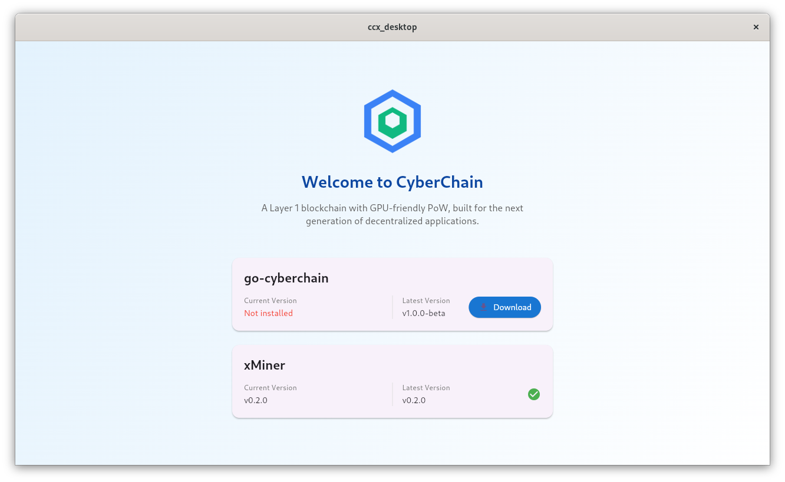
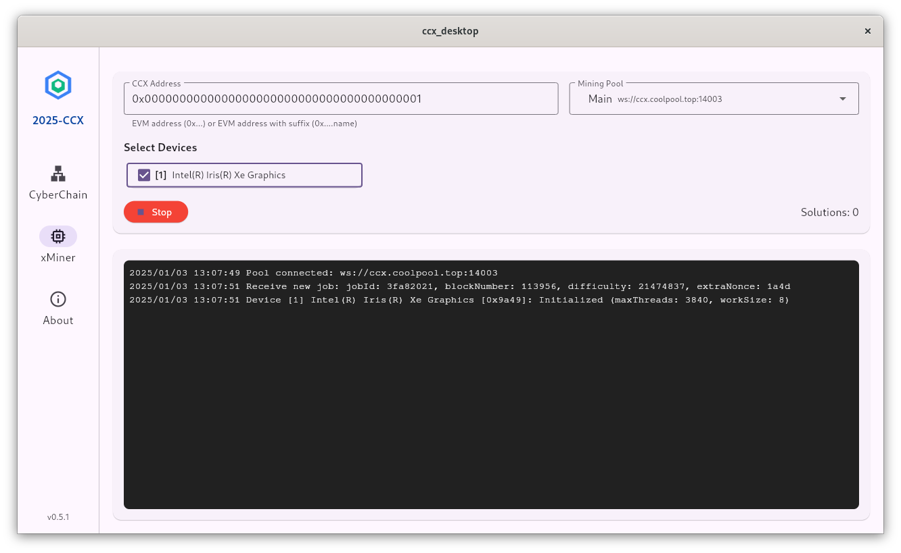
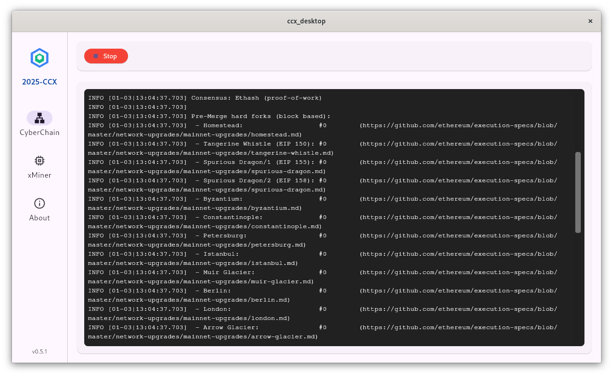
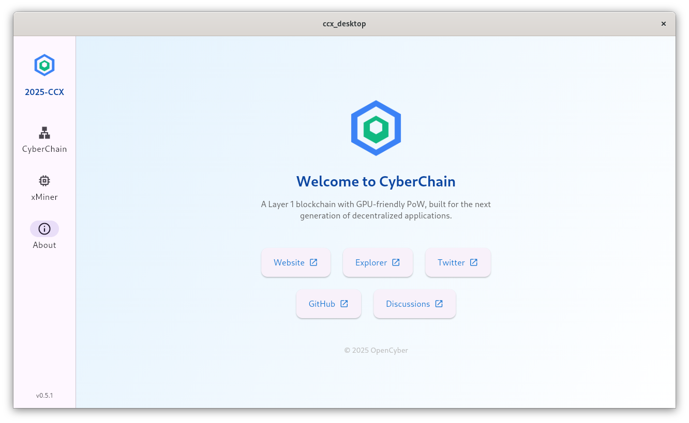

# CyberChain Desktop

CyberChain Desktop is the official desktop application for [CyberChain](https://cyberchain.xyz), a next-generation blockchain platform. Built with modern technology, it provides an intuitive interface for managing your CyberChain node and mining operations.

## Features

- 🚀 Modern and intuitive user interface
- 💻 Cross-platform support (Windows, Linux, macOS)
- ⛏️ Automatic management of CyberChain nodes and xMiner mining program
- 🔄 One-click mining with SOLO and Pool mining support
- 🌟 100% open source and portable
- 🛡️ Secure third-party GitHub builds
- 🔒 Safe and reliable operation

## Download

Download the latest version for your platform from our [Releases Page](https://github.com/CyberChainXyz/cyberchain-desktop/releases).

## Support

[Join CyberChain Community Discussions](https://github.com/orgs/CyberChainXyz/discussions)

## Screenshots

## License

This project is licensed under the terms specified in the [LICENSE](LICENSE) file.

